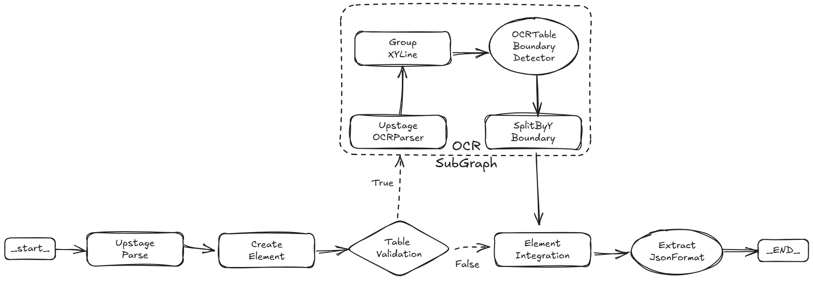

# Transcript Insight

Analyze university **transcripts → structured metrics → audience-ready reports** (Markdown & PDF).  
This project consists of a **FastAPI** backend and a **Streamlit** frontend and focuses on **parsing transcripts, computing metrics, visualizing charts, and generating downloadable reports**.

## Project Structure

- **FastAPI Backend**  
  API for parsing/analysis and long-running workflows (WebSocket streaming logs supported).  
  Main app: `main.py`, Dockerfile: `Dockerfile.api`.

- **Streamlit Frontend**  
  UI for uploading transcripts (PDF/JSON), configuring analysis, monitoring progress, and downloading the final report (Markdown/HTML→PDF).  
  Main app: `streamlit_app.py`, Dockerfile: `Dockerfile.streamlit`.

- **Agents (LangGraph)**  
  Parser Agent (OCR/structure), Transcript Analyst Agent (metrics → tables/charts → report writer).

## How it Works

- **Upload** a transcript (PDF or JSON) in the Streamlit UI.
- **Parser** extracts structured data (OCR via Upstage; graph-based subflow for tricky areas).
- **Analyst** computes metrics and generates tables/charts.
- **Report Writer** produces audience-tailored report in **Markdown or HTML**, and the frontend can export **PDF (WeasyPrint)**.
- Frontend ↔ Backend communicate over HTTP & WebSocket (live logs/progress).

## Parser

The parser uses a **graph-based** approach with OCR (Upstage API) and subgraphs for selective element OCR.



## Transcript Analyst

The Transcript Analyst Agent automates transcript analysis with a **LangGraph** pipeline.  
It produces a final report tailored to the audience with **tables and charts**.


---

## Local Development (uv)

Requires Python **3.10+** and [uv](https://github.com/astral-sh/uv).

```bash
# install deps (creates .venv/)
uv sync --no-cache

# run API (FastAPI)
uv run python -m uvicorn main:app --host 0.0.0.0 --port 8000

# run Streamlit UI
uv run python -m streamlit run streamlit_app.py
# (alternative) launcher script: uv run streamlit run streamlit_app.py
```

> If you see a `VIRTUAL_ENV ... does not match ...` warning, prefer the single project `.venv/` and run with `uv run ...`.  
> `python -m streamlit` is a robust fallback when a launcher script isn’t on PATH.

---

## Docker Setup

### .env for docker-compose

- Create a `.env` file at the project root before running `docker compose up`.
- Required for the parser agent (OCR + LLM): set `OPENAI_API_KEY` and `UPSTAGE_API_KEY`.
- `docker-compose.yml` already loads this via `env_file: .env`.

Example `.env`:

```
# required for parser agent
OPENAI_API_KEY=sk-...
UPSTAGE_API_KEY=upstage-...

# optional: LangSmith tracing
# LANGCHAIN_TRACING_V2=true
# LANGSMITH_API_KEY=ls-...
```


### Dockerfile.api (FastAPI)

- Installs **Nanum Gothic** (and **DejaVu**) fonts so charts/images render Korean labels correctly.
- Runs FastAPI via **uvicorn**.

**CMD example**

```dockerfile
CMD ["uv", "run", "python", "-m", "uvicorn", "main:app", "--host", "0.0.0.0", "--port", "8000"]
```

### Dockerfile.streamlit (Streamlit + PDF)

- Installs **WeasyPrint runtime** libs (Cairo / Pango / GDK-Pixbuf / libffi) and **Nanum Gothic** fonts for PDF generation with Korean.
- Runs Streamlit via `uv run streamlit run ...` (or `python -m streamlit`).

**CMD example**

```dockerfile
CMD ["uv", "run", "streamlit", "run", "streamlit_app.py", "--server.port=8501", "--server.address=0.0.0.0"]
```

### docker-compose.yml (minimal, internal networking)

```yaml
version: '3.8'

services:
  api:
    build:
      context: .
      dockerfile: Dockerfile.api
    ports:
      - "8000:8000"
    env_file:
      - .env

  streamlit:
    build:
      context: .
      dockerfile: Dockerfile.streamlit
    ports:
      - "8501:8501"
    environment:
      # Streamlit → FastAPI (use service name 'api' instead of localhost)
      BACKEND_URL: "http://api:8000"
      BACKEND_WS_URL: "ws://api:8000"
    depends_on:
      - api
```

**Run**

```bash
docker compose up --build
# API:       http://localhost:8000/docs
# Streamlit: http://localhost:8501
```

---

## Fonts & PDF (WeasyPrint)

To ensure Korean renders in PDF:

1. **Install fonts** in both containers (API for charts, Streamlit for final PDF):
   - `fonts-nanum`, `fonts-dejavu-core`
2. **WeasyPrint runtime** (Streamlit container):
   - `libcairo2`, `libpango-1.0-0`, `libpangoft2-1.0-0`, `libpangocairo-1.0-0`, `libgdk-pixbuf-2.0-0`, `libffi8`, `shared-mime-info`
3. **Font cache** after install:
   - `fc-cache -f`
4. **HTML to PDF**:
   - Use: `HTML(string=html, base_url=".").write_pdf(...)`
   - CSS example:
     ```css
     body { font-family: 'NanumGothic','DejaVu Sans',sans-serif; line-height: 1.45; }
     ```

---

## Configuration

- **Environment (Streamlit)**  
  `BACKEND_URL`, `BACKEND_WS_URL` must point to the API service from inside the container/network (`http://api:8000`, `ws://api:8000`).

- **Uploads & Exports**  
  The app saves intermediate artifacts (tables/charts) and the final report (Markdown/HTML/PDF).  
  Ensure writeable paths (e.g., `./test_data/users/{session_id}/...`) exist or are created at runtime.

- **WebSocket**  
  Streamlit listens to backend events via WebSocket for live progress; ensure URL uses `BACKEND_WS_URL`.

---

## Troubleshooting

- **`uv run streamlit` not found**  
  Use `uv run python -m streamlit run ...` or reinstall `streamlit` with `uv add streamlit && uv sync`.

- **Images/CSS missing in PDF**  
  Add `base_url="."` when calling `WeasyPrint.HTML(...)` so relative paths resolve.

- **Korean text broken in charts/PDF**  
  Confirm `fonts-nanum` is installed and `fc-cache -f` ran; ensure CSS sets the font family.

---

## Roadmap (excerpt)

- Advanced metrics planner (audience-aware objectives).  
- More robust DataFrame validation and error recovery.  
- Asset packaging & permalink for downloadable reports.
