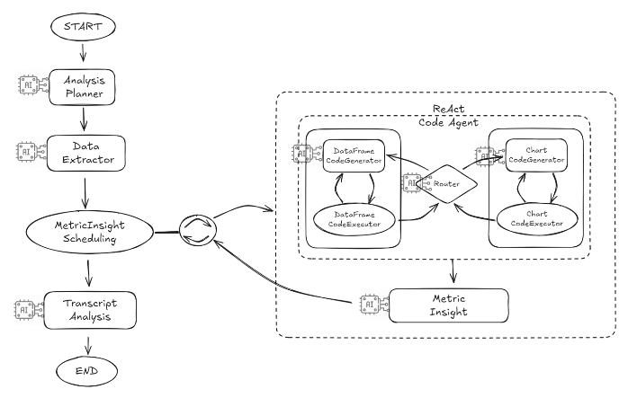

# Transcript Analysis Agent

성적표(Transcript) 데이터를 기반으로 **메트릭 기획 → 데이터 추출 → CSV/차트 생성 → 인사이트 작성 → 최종 보고서**까지 자동화하는 LangGraph 기반 에이전트입니다.  
최종 엔트리포인트는 **`transcript_analyst_graph()`**이며, 이 그래프 실행 결과가 API 출력(ReportState)입니다.

---

## 🧠 Graph 개요

파이프라인 실행 순서:

1) **AnalysisPlannerNode** → 2) **DataExtractorNode** → 3) **MetricInsightSchedulingNode**(서브그래프 실행) → 4) **MetricInsightNode** → 5) **TranscriptAnalystNode**


---

## 📂 Workdir Structure

실행 결과물은 **user_id / run_id** 단위로 관리되며 CSV/이미지 등 아티팩트와 로그 파일이 구조적으로 저장됩니다.

```
/root/
└── users/
    └── {user_id}/
        └── {run_id}/
            ├── artifacts/      # 실행 결과물 (CSV, 이미지, 리포트 등)
            └── logs/

example
/root/users/{user_id}/2025-08-03_160530/
  ├─ artifacts/
  │   ├─ 1723871120_df.csv
  │   └─ 1723871121_chart.png
  └─ logs/
      └─ 2025-08-03_160530.log
```

---

## 🔧 그래프 노드 설명

### 1) AnalysisPlannerNode
- **역할**: `AnalysisSpec`을 바탕으로 보고서에 포함할 **Metric**들을 설계합니다.
- **프롬프트**: [AnalysisPlannerNode 프롬프트](./prompts/analysis_planner_prompt.yaml)
- **LLM**: `gpt-4.1-mini` 
- **기본 포함 Metric**:  
  - `gpa_trend` — 학기별 GPA 추세 (line, table)  
  - `credit_category_share` — 이수 학점 카테고리 비중  
- **입력 → 출력**: `analysis_spec` → `metric_plan(1~4개 + 기본2개)`

### 2) DataExtractorNode
- **역할**: 원본 `dataset`에서 **InformMetric(학생/학적 요약)**을 추출하고, **semantic 검색 모드**인 Metric에 대해 과목명 리스트를 생성합니다.
- **LLM**: `gpt-4.1-mini`
- **프롬프트**: [DataExtractorNode 프롬프트](./prompts/data_extractor_prompt.yaml)
- **입력 → 출력**: `dataset`, `metric_plan` → `inform_metric`, `metric_plan(semantic_course_names 채움)`

### 3) MetricInsightSchedulingNode
- **역할**: Metric별로 **ReAct Code Agent 서브그래프**를 실행하여 DataFrame/CSV 생성 및 Chart(PNG)를 만듭니다.
- **LLM**: `gpt-4.1-mini`
- **프롬프트**: [MetricInsightSchedulingNode 프롬프트](./prompts/metric_insight_scheduling_prompt.yaml)
- **입력 → 출력**: `dataset`, `metric_plan`, `run_id` → Metric별 `csv_path`, `img_path`, `cost`
- **비고**:  참조.

### 4) MetricInsightNode
- **역할**: Data + MetricSpec + AnalysisSpec을 입력으로 **2~5줄 인사이트**를 생성합니다. 필요시 `csv_path`/`chart_path`도 포함합니다.
- **LLM**: `gpt-4.1-mini`
- **프롬프트**: [MetricInsightNode 프롬프트](./prompts/metric_insight_prompt.yaml)
- **입력 → 출력**: `csv_path`, `chart_path`, `metric_spec`, `analysis_spec` → `metric_insight`(v2)

### 5) TranscriptAnalystNode
- **역할**: 모든 `metric_insight` + `inform_metric` + `AnalysisSpec`을 종합해 **최종 마크다운 리포트**를 작성합니다.
- **LLM**: `gpt-4.1-mini`
- **프롬프트**: [TranscriptAnalystNode 프롬프트](./prompts/transcript_analyst_prompt.yaml)
- **입력 → 출력**: `report(str)`

---

## 📝 AnalysisSpec (반드시 직접 입력)

**`AnalysisSpec`은 리포트의 방향성과 품질을 좌우하는 핵심 입력값**입니다.  
분석의 맥락(누가/무엇을/왜 평가하는가)을 명확히 기술해야 하며, **정확하고 구체적일수록 결과물이 좋아집니다.**

```python
from typing import List, Optional, Literal
from pydantic import BaseModel

class AnalysisSpec(BaseModel):
    # 분석 주제
    focus: List[str]  
    
    # 독자 맥락
    audience: Literal["student","evaluator","advisor"] = "student"
    audience_spec: str = ""  
    audience_goal: str = "general insight"
    audience_values: List[str] = []          # ex) ["성실성","논리적 사고"]
    evaluation_criteria: List[str] = []      # ex) ["전공 성취도", "일관성"]
    decision_context: str = "채용 선발"      # ex) "채용 선발", "장학금 심사"
    
    # 분석 범위
    time_scope: str = "전체 학기"
    comparison_target: Optional[str] = None
    priority_focus: List[str] = []           # 분석 중 가장 강조할 포인트
    
    # 보고서 톤/스타일
    tone: Literal["neutral","encouraging","formal"] = "neutral"
    language: Literal["ko","en"] = "ko"
    detail_level: Literal["summary","balanced","in_depth"] = "balanced"
    insight_style: Literal["descriptive","comparative","predictive"] = "descriptive"
    evidence_emphasis: Literal["low","medium","high"] = "medium"
    tone_variation: Optional[str] = None
    
    # 산출물 구성
    output_format: List[Literal["text","chart","table","recommendation"]] = ["text"]
    include_recommendations: bool = False
    highlight_style: Literal["numbers","growth","risk","strengths"] = "growth"
```

### 필드
- **focus**: 분석 주제 목록. 예) `"GPA trend"`, `"major GPA"`, `"수학 과목 성취도"`  
- **audience / audience_spec / audience_goal**: 대상과 목적을 구체화. 예) `"evaluator"`, `"AI company recruiter"`, `"수학적 사고 평가"`  
- **audience_values / evaluation_criteria**: 평가자가 중시하는 가치와 평가 항목. 예) `["성실성","논리적 사고"]`, `["전공 성취도","일관성"]`  
- **decision_context**: 활용 맥락 명시(채용, 장학금, 승진 등).  
- **time_scope / comparison_target**: 분석 기간(최근 N학기 등)과 비교 기준(동일 전공 평균 등).  
- **tone / language / detail_level**: 톤/언어/디테일.  
- **output_format / include_recommendations**: 출력 형태와 추천 포함 여부.

### 방향성 예시
- **맥락을 최대한 구체화**하세요. (예: *“AI 채용 실무자 관점에서, 최근 4학기 성과와 전공 수학 과목 중심으로, 성장 가능성을 강조”*)  
- **priority_focus**에 핵심 포인트 1–3개 지정 → 인사이트가 선명해집니다.  
- **comparison_target** 제공 → 비교/해석의 밀도가 올라갑니다.  
- **output_format**에 `"chart"`/`"table"` 포함 → 리포트 설득력 강화.

---

## 🧮 Metrics & Data Extraction

- **AnalysisPlannerNode**: `AnalysisSpec`을 바탕으로 1–4개의 추가 Metric을 설계합니다. (기본 + 사용자 정의)  
- **기본 Metric**
  - `gpa_trend` — 학기별 GPA 추세 (line chart, table)  
  - `credit_category_share` — 이수 학점 카테고리 비중 (pie chart, table; **라벨은 한글 원문**)
- **DataExtractorNode**: InformMetric(이름/대학/학과/입·졸업/학점/GPA 등)과 **semantic_course_names**(필요 Metric에 한해 과목명 리스트)를 생성합니다.

---

## 🧮 CSV & Chart 생성 (ReAct Code Agent)

- Metric별로 서브그래프를 실행해 **DataFrame 코드 생성 → 실행(CSV 저장) → 차트 코드 생성 → 실행(PNG 저장)**을 수행합니다.  
- 차트는 Matplotlib 기반이며, **한글 폰트 자동 적용**(NanumGothic / Noto Sans CJK / DejaVu Sans) 로직을 포함합니다.  
- 생성 결과는 `{user_id}/{run_id}/artifacts/` 아래에 저장됩니다.

---

## 🗣️ Insight & Report

- **MetricInsightNode**: (CSV→DataFrame) + MetricSpec + AnalysisSpec을 입력으로 받아 **2–5줄 분석 요약**을 생성합니다. 필요 시 표/차트 경로도 포함합니다.  
- **TranscriptAnalystNode**: 모든 인사이트와 학적 요약, AnalysisSpec을 종합해 **최종 마크다운 리포트 문자열**을 생성합니다.

---

## ⚙️ 사용법 (간단 예시)

```python
from langchain_core.runnables import RunnableConfig
from analyst_agent.graph import transcript_analyst_graph
from analyst_agent.report_plan_models import AnalysisSpec

graph = transcript_analyst_graph(verbose=False)

state = {
    "dataset": {...},                 # 성적표 원본 JSON/dict
    "analyst": AnalysisSpec(
        focus=["GPA trend","major GPA","수학 과목 성취도"],
        audience="evaluator",
        audience_spec="AI company recruiter",
        audience_goal="수학적 사고와 성장 가능성 평가",
        time_scope="최근 4학기",
        priority_focus=["전공 수학 과목 성취도"],
        output_format=["text","chart","table","recommendation"],
        include_recommendations=True,
        language="ko",
        tone="formal"
    ),
    "run_id": "2025-09-02T20:00:00+09:00"
}

result = graph.invoke(input=state, config=RunnableConfig(thread_id=state["run_id"]))
print(result["report"])      # 최종 마크다운 리포트
```

---

## 📤 API 출력 (ReportState 주요 키)

- **report** *(str)*: 최종 리포트(마크다운 텍스트).  
- **report_plan** *(List[MetricInsightv2])*: 각 Metric의 인사이트 + (선택) `dataframe`/`csv_path`/`chart_path`.  
- **metric_plan** *(List[MetricSpec])*: 실제 실행에 사용된 메트릭 목록.  
- **inform_metric** *(InformMetric)*: 이름/대학/학과/입·졸업/총이수학점/GPA/백분율 등 요약.  
- **cost** *(float)*: OpenAI 호출 누적 비용(USD).  
- **run_id** *(str)*: 실행 ID(스레드/체크포인터에 사용).

---

## 🔎 추가 규칙(그래프 런타임)

- **semantic_course_names**가 존재하는 Metric은, **해당 과목만 사용**해 DataFrame을 추출합니다.  
- `compute_hint`/`chart_type`을 준수해 DF/Chart를 생성합니다.  
- **`produces == "table"`**인 경우 DF만 생성합니다.  
- 차트의 **과목 라벨은 원문 한글**을 그대로 사용합니다.  
- 평균값을 임의 계산하지 말고, 원자료를 활용한 집계를 우선합니다. (단, `produces == "metric"` 예외)

---

## ✅ 요약

- **AnalysisSpec을 잘 작성**하는 것이 가장 중요합니다. 맥락/목표/평가기준/우선순위를 구체적으로 넣으세요.  
- 파이프라인은 Metric 설계 → 데이터/과목 추출 → CSV/차트 생성 → 인사이트 → 최종 보고서 작성 순서로 진행됩니다.  
- 결과물은 `{user_id}/{run_id}` 단위로 정리되어 재현성/추적성이 좋습니다.
