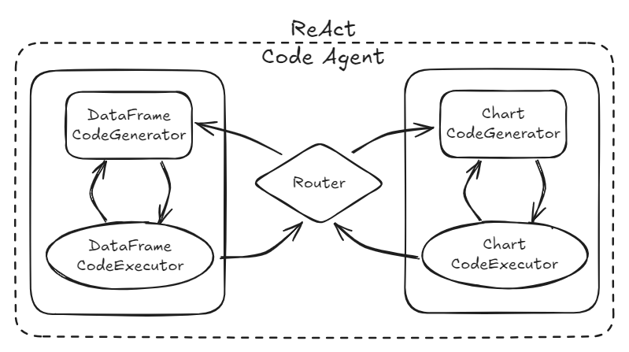
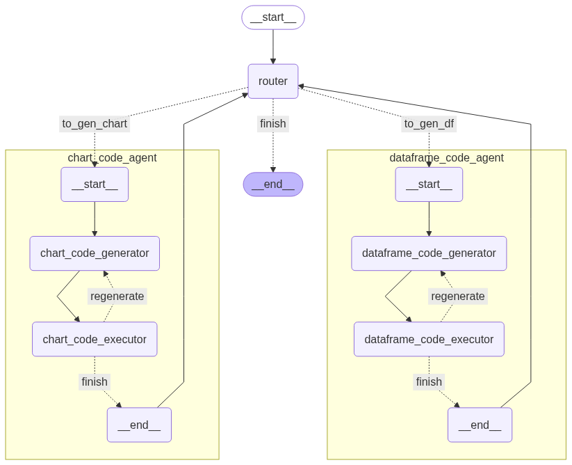

# ReACT Code Agent

ReACT Code Agent는 **자연어 쿼리 → DataFrame 생성 → 차트 생성**의 과정을 자동화하는 LangGraph 기반 AI 에이전트입니다.  
LLM으로 코드를 생성하고, 실행하며, 결과물(아티팩트/로그)을 일관된 디렉터리 구조로 저장합니다.





---

## 📂 Workdir Structure

실행 결과물은 **user_id / run_id** 단위로 관리되며, CSV/이미지 등 아티팩트와 로그 파일이 구조적으로 저장됩니다.

```
/root/
└── users/
    └── {user_id}/
        └── {run_id}/
            ├── artifacts/      # 실행 결과물 (CSV, 이미지, 리포트 등)
            └── logs/

example
/root/users/{user_id}/2025-08-03_160530/
  ├─ artifacts/
  │   ├─ 1723871120_df.csv
  │   └─ 1723871121_chart.png
  └─ logs/
      └─ 2025-08-03_160530.log
```

---

## 상태(States)
- **DataFrameState**: `df_code`, `df_name`, `df_desc`, `df_meta`, `csv_path`, `stdout`, `stderr`, `errors`, `attempts` …
- **ChartState**: `chart_code`, `chart_name`, `chart_desc`, `img_path`, `stdout`, `stderr`, `debug_font`, `errors`, `attempts` …
- **AgentContextState**: `user_query`, `dataset`, `run_id`, `next_action`, `previous_node` 등 전체 플로우 제어용


## 특징
- **LLM 기반 코드 생성**: Prompt + Structured Output(Pydantic) 활용
- **자동 실행/저장**: 생성 코드 자동 실행 → CSV/PNG 등 아티팩트 저장
- **동적 라우팅**: RouterNode가 ReAct 스타일로 플로우 제어
- **Artifact 관리 표준화**: 실행 단위별 `{user_id}/{run_id}`로 결과물 정리

---

## Prompt 링크 모음

- DataFrame Code: [`prompts/generate_dataframe_code.yaml`](prompts/generate_dataframe_code.yaml)  
- Chart Code: [`prompts/generate_chart_code.yaml`](prompts/generate_chart_code.yaml)  
- Router: [`prompts/router.yaml`](prompts/router.yaml)


## 주요 컴포넌트 (Nodes)


### 1) DataFrameCodeGeneratorNode
- **역할**: JSON `dataset` + `user_query` → **DataFrame 생성 코드** 작성
- **LLM**: `gpt-4.1-mini`
- **프롬프트**: [`prompts/generate_dataframe_code.yaml`](prompts/generate_dataframe_code.yaml)
- **출력**: 
  - `df_code` (Python code)
  - `df_name` (DataFrame name)
  - `df_desc` (DataFrame description)

---

### 2) DataFrameCodeExecutorNode
- **역할**: `df_code` 실행 → DataFrame 생성 및 CSV 저장
- **주요 기능**
  - 헬퍼 제공: `save_df(df, name)` → `{artifact_dir}/{timestamp}_{name}.csv` 저장
  - 메타데이터 수집: `df_meta`(schema/shape/columns, 샘플 등)
  - state 갱신: `df_handle`, `df_meta`, `csv_path`, `stdout`, `stderr`, `errors`, `attempts`

- **실행 환경(Global) Alias**
  - `pd`, `json`, `save_df`, `INPUT_DATA`(원본 JSON/dict)

---

### 3) ChartCodeGeneratorNode
- **역할**: `user_query` + `df_name/df_desc` + `csv_path/df_meta/df_code` → **차트 코드** 작성
- **LLM**: `gpt-4.1-mini`
- **프롬프트**: [`prompts/generate_chart_code.yaml`](prompts/generate_chart_code.yaml)
- **출력**
  - `chart_code` (Python code)
  - `chart_name` (영문 차트 제목)
  - `chart_desc` (차트 설명/목적, 한글)

---

### 4) ChartCodeExecutorNode
- **역할**: `chart_code` 실행 → 이미지 파일(PNG) 저장
- **주요 기능**
  - Matplotlib 기반 시각화
  - 한글 폰트 자동 적용: NanumGothic / Noto Sans CJK / DejaVu Sans (fallback)
  - 헬퍼 제공: `save_chart(filename="...", dpi=170)`
  - state 갱신: `img_path`, `stdout`, `stderr`, `debug_font`, `errors`, `attempts`

- **실행 환경(Global) ALias**
  - `pd`, `plt`, `save_chart`, `use_korean_font()`

---

### 5) RouterNode
- **역할**: ReAct 스타일 라우팅(Reasoning). 다음 단계 결정
  - `to_gen_df` : DataFrame 생성 필요
  - `to_gen_chart` : Chart 생성 필요
  - `finish` : 종료
- **LLM**: `gpt-4o-mini`
- **프롬프트**: [`prompts/router.yaml`](prompts/router.yaml)
- **출력**
  - `next_action` (위 역할 3가지 중 하나)
  - `reason` (추론 근거)


