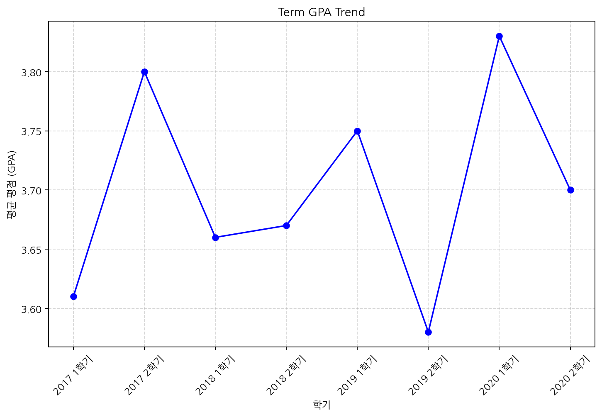
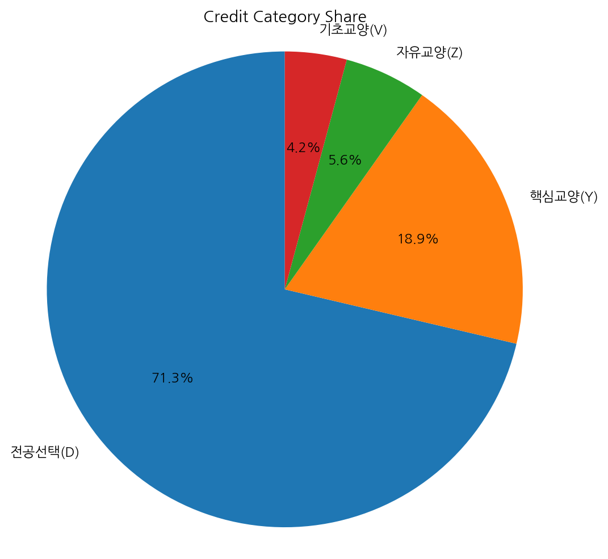
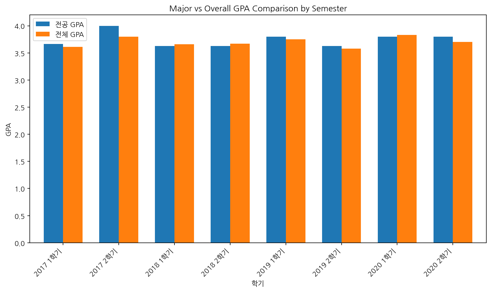
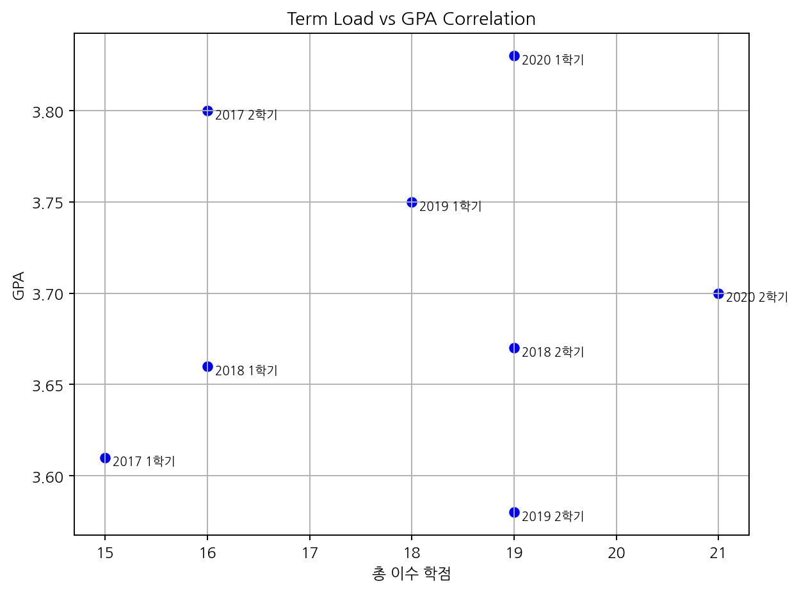

# 김민지 학생 성적 분석 보고서

---
- 작성일: 2025-09-02
- 대상 독자: AI 기업 채용 담당자
- 목표: 수학적 사고가 뛰어난 지원자 선발을 위한 전공 및 수학 관련 과목 성취도 분석

---

## 학생 요약

김민지 학생은 연세대학교 컴퓨터과학과(2017.03 입학, 2021.08 졸업) 출신으로, 총 143학점을 이수하며 전체 GPA 3.7(92%)를 기록하였습니다. 전공 과목 이수 비중이 높고, 전공 GPA가 전체 GPA를 상회하는 안정적인 학업 성과를 보입니다. 수학 관련 과목에서는 선형대수학에서 우수한 성적(A0)을 받았으며, 미적분학 I과 확률및통계는 B0 수준으로 양호한 편입니다.

| 항목             | 내용               |
|----------------|------------------|
| 이름             | 김민지             |
| 대학             | 연세대학교           |
| 학과             | 컴퓨터과학과          |
| 입학일            | 2017-03-02        |
| 졸업일            | 2021-08-17        |
| 총 이수 학점        | 143 학점           |
| 전체 GPA          | 3.7               |
| 전체 성적 백분율     | 92%               |

---

## Executive Summary

김민지 학생은 전공 GPA가 전체 GPA보다 높아 전공 과목에 대한 이해도가 뛰어납니다. 전체 학기 동안 GPA가 3.58에서 3.83 사이로 꾸준히 유지되어 성실성과 논리적 문제 해결 능력을 보여줍니다. 수학 관련 과목에서는 선형대수학에서 우수한 성적을 기록했으며, 전공 과목 이수 비중이 71.3%로 높아 수학적 사고 능력이 반영된 학습 집중도를 확인할 수 있습니다. 다만, 수학 관련 과목 수가 적어 전체적인 수학 역량 평가는 제한적입니다.

---

## Analysis Focus

- GPA 추세 및 꾸준한 학업 성취도 확인
- 전공 GPA와 전체 GPA 비교를 통한 전공 성취도 평가
- 수학 관련 과목 성적 분석으로 수학적 사고력 검증
- 전공 과목 이수 비중 및 학기별 이수 학점과 GPA 상관관계 분석

---

## Term별 GPA 변화 추세

지원자의 전체 학기 GPA는 3.58에서 3.83 사이로 안정적이며, 2020년 1학기에 최고점 3.83을 기록하였습니다. GPA 변동폭이 크지 않아 꾸준한 성실성과 논리적 문제 해결 능력을 시사합니다. 동일 전공 평균과의 직접 비교 데이터는 없으나 우수한 성적 유지가 예상됩니다.

| 지표       | 값   | 단위 |
|----------|-----:|:----|
| 최저 GPA   | 3.58 |      |
| 최고 GPA   | 3.83 |      |
| 평균 GPA   | 3.7  |      |

차트 설명: 학기별 GPA가 전반적으로 3.6 이상을 유지하며 2020년 1학기에 최고점 도달

- GPA가 학기별로 안정적이며 꾸준한 상승 흐름을 보임
- 성실성과 논리적 문제 해결 능력에 긍정적 근거 제공
- 동일 전공 평균과의 비교 데이터 부재로 상대적 우수성은 추후 검증 필요

데이터 출처: artifacts/1756821179_term_gpa_trend.csv

- 전공 및 수학 과목별 세부 성적은 포함되어 있지 않음
- 동일 전공 평균과의 직접 비교 데이터 미제공

---

## 이수 학점의 카테고리별 구성 비중

전체 이수 학점 중 전공선택 과목이 71.3%로 가장 큰 비중을 차지하며, 이는 전공 집중도가 높음을 의미합니다. 핵심교양 18.9%, 자유교양 5.6%, 기초교양 4.2% 순으로 구성되어 있습니다.

| 지표             | 값    | 단위 |
|----------------|-------:|:----|
| 전공선택(D) 학점 비중 | 71.3  | %    |
| 핵심교양(Y) 학점 비중 | 18.9  | %    |
| 자유교양(Z) 학점 비중 | 5.6   | %    |
| 기초교양(V) 학점 비중 | 4.2   | %    |

차트 설명: 전공선택 학점 비중이 압도적으로 높아 전공 집중 학습 경향 확인

- 전공 과목에 집중한 학습 경향이 수학적 사고 및 전공 성취도 평가에 긍정적
- 교양 과목 비중은 상대적으로 낮아 전공 심화에 집중한 점 부각

---

## 전공 과목 GPA와 전체 GPA 비교

전공 GPA는 전체 GPA(3.7)보다 높은 3.74로, 전공 과목에서 우수한 성취도를 보입니다. 2017년 2학기에는 전공 GPA가 4.0으로 최고점을 기록하였으며, 각 학기별로도 전공 GPA가 꾸준히 전체 GPA를 상회합니다.

| 지표                 | 값   | 단위 |
|--------------------|-----:|:----|
| 전체 전공 GPA 평균      | 3.74 |      |
| 전체 GPA 평균          | 3.7  |      |
| 최고 전공 GPA (2017-2학기) | 4.0  |      |

차트 설명: 전공 GPA가 전체 GPA보다 지속적으로 높게 유지됨

- 전공 과목 성취도가 전반적으로 우수함을 명확히 보여줌
- 수학적 사고와 전공 관련 논리적 문제 해결 능력 발휘 근거
- 꾸준한 전공 성과 유지로 성장 가능성 긍정적 평가

---

## 수학 관련 과목 성취도 분석

2017년부터 2018년까지 미적분학 I, 선형대수학, 확률및통계 세 과목의 성적은 선형대수학 A0, 나머지는 B0 수준으로 안정적입니다. 다만, 수학 관련 과목 수가 적어 전체 수학 역량 평가에는 한계가 있습니다.

| 지표         | 값  | 단위 |
|------------|-----|:----|
| 미적분학 I 성적 | B0  |      |
| 선형대수학 성적 | A0  |      |
| 확률및통계 성적 | B0  |      |

- 선형대수학에서 우수한 성과를 기록하여 수학적 사고 능력 일부 확인 가능
- 미적분학 I과 확률및통계는 양호한 수준으로 수학적 기초 역량 유지
- 과목 수가 3개로 제한적이며, 2017~2018년 데이터만 포함되어 평가 범위 제한

- 분석 대상 수학 관련 과목 수가 적어 전체 성취도 평가에 한계 존재
- 성적 데이터는 2017년부터 2018년까지로 최신 학기 반영 부족

---

## 학기별 이수 학점과 GPA 상관관계 분석

학기별 이수 학점은 15학점에서 21학점 사이로 변동하였으며, GPA는 3.58에서 3.83 사이에 분포합니다. 일부 학기에서는 높은 학점과 높은 GPA가 동시에 나타나 전공 성취도가 안정적으로 유지됨을 보여줍니다.

| 지표       | 값   | 단위 |
|----------|-----:|:----|
| 최소 이수 학점 | 15   | 학점 |
| 최대 이수 학점 | 21   | 학점 |
| 최저 GPA   | 3.58 |      |
| 최고 GPA   | 3.83 |      |

차트 설명: 학점 변동에도 GPA가 안정적으로 유지됨을 시각화

- 학점 부담이 크더라도 GPA 하락 없이 꾸준한 전공 성취도 유지
- 수학적 사고와 논리적 문제 해결 능력이 지속적으로 발휘된 결과로 해석 가능

---

## 종합 평가

**강점**
- 전공 GPA가 전체 GPA보다 높아 전공에 대한 높은 이해도와 성취도 확인
- 전체 학기 GPA가 3.58 이상으로 꾸준히 안정적이며, 최고 3.83 기록
- 전공선택 과목 이수 비중이 71.3%로 전공 집중도가 매우 높음
- 수학 관련 과목 중 선형대수학에서 우수한 성적(A0) 획득
- 학기별 이수 학점 증가에도 GPA가 유지되어 성실성과 문제 해결 능력 입증

**개선점**
- 수학 관련 과목 수가 3개로 제한적이며, 최신 학기 수학 성적 데이터 부족
- 동일 전공 평균과의 직접 비교 자료 부재로 상대적 우수성 평가에 한계

**리스크**
- 수학적 사고 역량을 전반적으로 평가하기에는 수학 과목 이수 및 성적 데이터가 제한적임
- 교양 과목 이수가 상대적으로 적어 전반적 학문적 폭이 좁을 수 있음

---

## 권고 및 다음 단계

1. 추가 수학 관련 과목 이수 및 성적 확보를 권장하여 수학적 사고력 평가 범위 확대
2. 동일 전공 학생 평균 성적과 비교 분석을 통해 상대적 경쟁력 검증
3. 지원자의 문제 해결 사례 및 프로젝트 경험을 심층 면접에서 확인하여 논리적 사고력 평가 보완
4. 학업 외 활동에서의 성실성과 성장 가능성을 평가할 수 있는 자료 수집 권장
5. 수학적 사고가 요구되는 실무 과제나 테스트를 통해 실제 역량 검증 병행

---

## 한계 및 주의사항

- 전공 및 수학 관련 과목별 세부 성적 데이터는 일부만 포함되어 전체 성취도 평가에 제한이 있음
- 동일 전공 평균과의 직접 비교 데이터가 제공되지 않아 상대적 우수성 판단에 한계 존재
- 수학 관련 과목은 2017~2018년 3과목만 분석되어 최신 학기 성적 반영 부족
- 분석 자료는 학업 성적에 한정되어 실무 능력 및 인성 평가는 별도 검증 필요